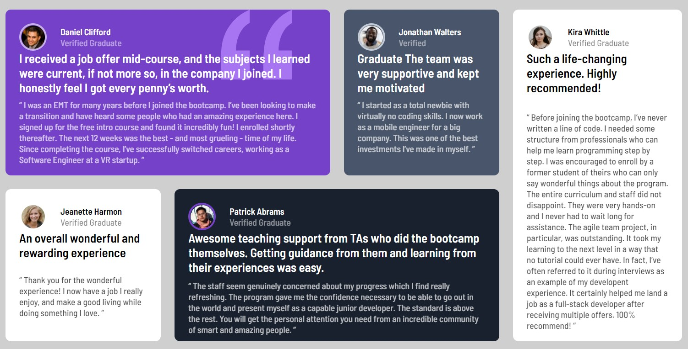

# Frontend Mentor - Testimonials grid section solution

This is a solution to the [Testimonials grid section challenge on Frontend Mentor](https://www.frontendmentor.io/challenges/testimonials-grid-section-Nnw6J7Un7). Frontend Mentor challenges help you improve your coding skills by building realistic projects.

## Table of contents

- [Overview](#overview)
  - [The challenge](#the-challenge)
  - [Screenshot](#screenshot)
  - [Links](#links)
- [My process](#my-process)
  - [Built with](#built-with)
  - [What I learned](#what-i-learned)
  - [Continued development](#continued-development)
  - [Useful resources](#useful-resources)
- [Author](#author)
- [Acknowledgments](#acknowledgments)

## Overview

### The challenge

Users should be able to:

- View the optimal layout for the site depending on their device's screen size.
- View a final "product" as similar as possible to the original design, in my case I have had no access to the sketch or the Figma file, therefore spaces/sizes/... are "estimated"

### Screenshot

### Links

- Solution URL: https://bertapsan.github.io/challenge-testimonials-grid-section-bertapsan/
## My process

### Built with

- StarterKit from Adalab (Bootcamp)
- Semantic HTML5 markup
- Sass (variables, reset and mixins)
- CSS Grid
- Mobile-first workflow

### What I learned

My major learning with this project has been to "translate" design into grid

<h1>Some code I'm proud of:</h1>
<ul>
  <li>Grid</li>
  <li>Variables</li>
  <li>Sass</li>
  <li>Mixins</li>
</ul>

### Continued development

I want to continue working on code optimization and acquire knowledge to add testing to my projects.

### Useful resources

- [CSS-tricks](https://css-tricks.com/snippets/css/complete-guide-grid/) - This helped me to understand grid container/items properties . I really liked this pattern and will use it going forward.

## Author

- Website - [bertapsan - My github](https://github.com/bertapsan)
- Linkedin - [Berta Pluma - My Linkedin](https://www.linkedin.com/in/bertaplumasanjurjo/?locale=en_US)
- Twitter - [@bertapsan - My Twitter](www.https://twitter.com/BertaPSan)
- Frontend Mentor - [@bertapsan - My Frontmentor](https://www.frontendmentor.io/profile/bertapsan)

## Acknowledgments

A special thankyou to @NataliaMigallon (https://github.com/NataliaMigallon) to help me with some image root issues ;-)

Also, a special mention to @fmontes for letting me know Frontend Mentor.
